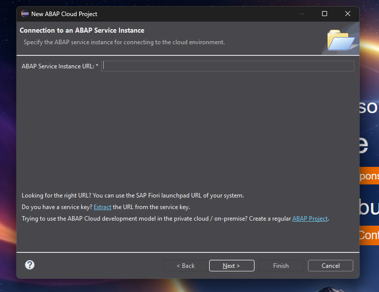
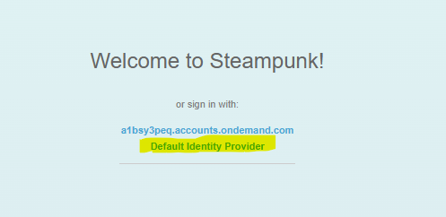
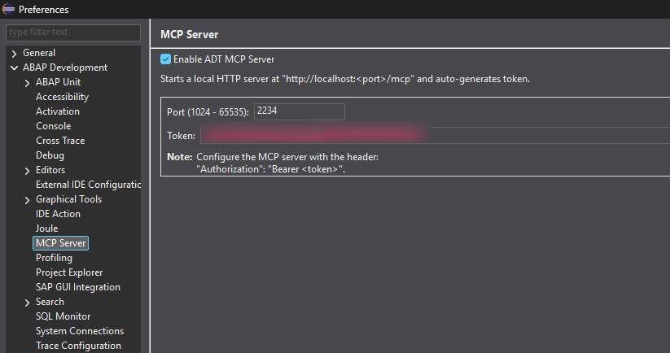
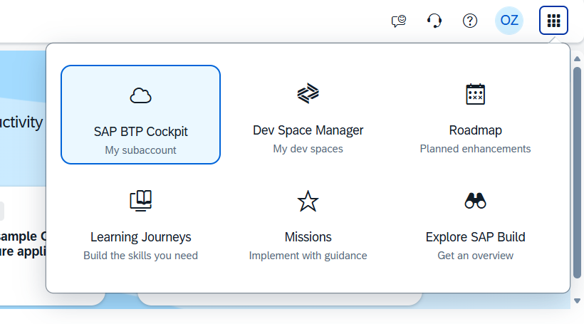

# Car Rental Workshop

Build a car-rental application with **ABAP RAP**, **SAPUI5**, and **GitHub
Copilot**. Start by turning a business problem into your own specification,
then use it to guide implementation and testing.

In **part 1**, you build your own RAP backend in `ZCARRENTAL_<INITIALS>`.
In **part 2**, you build a freestyle SAPUI5 frontend on top of that backend.

## Your Initials

Throughout this workshop, replace `<INITIALS>` with the initials listed for you
below. Use uppercase initials in ABAP package and object names. For example,
Stijn Verdoodt (`SV`) would use package `ZCARRENTAL_SV` and object suffix `_SV`.

<details>
<summary>Find your initials</summary>

| Participant | Initials |
| --- | --- |
| Karen Verrecas | KV |
| Patricia Van Roey | PVR |
| Jean-François Baele | JFB |
| Philippe Van Cauwenberge | PVC |
| Erik Denecker | ED |
| Jo Casier | JC |
| Gaurav Patwari | GP |
| Jessy Biju | JB |
| Lennert De Cleen | LDC |
| Fabian De Greef | FDG |
| Jef Van Rymenant | JVR |
| Erik Menten | EM |
| Cédric Decreton | CD |
| Wouter De Smed | WDS |
| Selva Kumar Muthu Gopal | SMG |
| Toon Van Lishout | TVL |
| Kim Uyttebrouck | KU |
| Jonathan Maesen | JM |
| Felipe Rezende Bastos | FRB |

</details>

## Set Up Eclipse

Make sure your installation meets these minimum versions:

| Software | Minimum Version |
| --- | --- |
| Eclipse IDE | 2026-03 |
| ABAP Development Tools (ADT) | 3.60 |
| GitHub Copilot plugin for Eclipse | 0.21 |

If you already have these versions or newer, skip the installation details
below. Use a Java runtime supported by the
[SAP ADT installation requirements](https://tools.hana.ondemand.com/#abap).

### 1. Install Eclipse and ADT

<details>
<summary>How to install Eclipse and ADT</summary>

1. Install [Eclipse IDE for Java Developers](https://www.eclipse.org/downloads/packages/),
   release **2026-03 or newer**.
2. Start Eclipse with a dedicated workshop workspace.
3. Open **Help > Install New Software**. In **Work with**, enter
   `https://tools.hana.ondemand.com/latest`.
4. Select **ABAP Development Tools**, version **3.60 or newer**, complete the
   installation, and restart Eclipse when prompted.
5. Check out this cheat sheet for ADT: [ADT Cheat Sheet](https://community.sap.com/t5/application-development-and-automation-blog-posts/abap-in-eclipse-keyboard-shortcuts-you-cannot-miss-cheat-sheet/ba-p/13345469)

</details>

Open Eclipse with your workshop workspace, then open the **ABAP** perspective
via **Window > Perspective > Open Perspective > Other**.

### 2. Install GitHub Copilot

<details>
<summary>How to install the GitHub Copilot plugin</summary>

1. Open **Help > Eclipse Marketplace**, search for **GitHub Copilot**, and
   install the GitHub Copilot plugin, version **0.21 or newer**. Restart Eclipse when
   prompted.

</details>

Use the Copilot icon to sign in to GitHub. Complete the browser/device-code
flow with the account that has Copilot access. Open **Copilot Chat** and check
that you can send a message and get a response.

See [GitHub's Eclipse installation guide](https://docs.github.com/en/copilot/how-tos/set-up/install-copilot-extension?tool=eclipse)
if installation or sign-in fails.

### 3. Connect to the Workshop System

1. Open **File > New > Other > ABAP > ABAP Cloud Project**.
2. On **Connection to an ABAP Service Instance**, enter this **ABAP Service
   Instance URL**, then click **Next**:

   <https://51a28523-2f07-43fa-8a52-517da6753fd4.abap.eu10.hana.ondemand.com>

   

3. Continue with browser-based sign-in. On the **Welcome to Steampunk!** page,
   choose **Default Identity Provider** and sign in with your workshop SAP
   account. Return to Eclipse and finish creating the project.

   

4. In the ABAP project, add `ZCARRENTAL_<INITIALS>` to **Favorite Packages**,
   replacing `<INITIALS>` with your initials from the [list above](#your-initials).
5. Expand the package and check that the tables and seed class listed below
   are present. Use a table's **Open With > Data Preview** to inspect the data.

The system URL is not confidential. Keep passwords, any credentials in the
emailed connection JSON, and your local MCP bearer token private.

If sign-in fails or your package is missing, ask a facilitator. Do not create
a replacement package or use somebody else's package.

### 4. Scope Copilot to Your Package

**Do this before asking Copilot to inspect or generate ABAP code.** We share one
system, and ABAP object names are system-wide, not isolated by package.

1. In Copilot Chat, open the menu and select **Edit preferences**.
2. Expand **GitHub Copilot > Custom Instructions** and select **Enable workspace
   instructions**.
3. Add the text below in the **Workspace** section. Replace **every**
   `<INITIALS>` with your initials from the list above.
4. Apply the settings. Start a new chat and ask Copilot which package and object
   suffix it will use. Check its answer before proceeding.

```text
We are building an ABAP Cloud RAP application in SAP BTP ABAP Environment.
My initials are <INITIALS>. My development package is ZCARRENTAL_<INITIALS>.

- Search, read, create, and change workshop objects only in ZCARRENTAL_<INITIALS>.
- Put every new ABAP repository object in this package and end its name
   with _<INITIALS>. Verify the target package and object name before each change.
- Do not browse, copy, or modify other participants' work, facilitator
  packages, or reference solutions. Do not use system-wide Z* searches.
- You may consult SAP documentation and use released SAP standard APIs;
  never modify SAP standard objects.
- Build on the supplied tables. Do not recreate or change their definitions
  without my explicit approval.
- Do not run seed/reset classes or other destructive operations without
  my explicit approval. Never run shared setup or teardown tools.
- If a task requires workshop objects outside my package, stop and ask.
- Help me clarify requirements and write my own specification before
  generating implementation code. Do not silently invent business rules.
```

These settings apply to your local Eclipse workspace, so no instruction file
needs to be added to this repository. See
[GitHub's custom-instructions guide for Eclipse](https://docs.github.com/en/copilot/how-tos/configure-custom-instructions-in-your-ide/add-repository-instructions-in-your-ide?tool=eclipse)
if your menus differ.

**Instructions guide Copilot; they are not access controls.** Review the target
package, object names, and proposed changes before approving tool calls.

### 5. Connect Copilot to the ADT MCP Server

Copilot uses **MCP** to access ABAP development tools. A working chat alone does
not confirm that this connection is working.

1. Open **Window > Preferences > ABAP Development > MCP Server**.
2. Select **Enable ADT MCP Server**, set **Port** to `2234`, and apply the
   settings. ADT starts the local server at `http://localhost:2234/mcp` and
   automatically generates a token.
3. Copy the value from the **Token** field. Use the token from your own Eclipse
   workspace, not another participant's token or the emailed connection JSON.

   

4. In Copilot Chat, select **Edit preferences > GitHub Copilot > MCP**.
5. Under **Server Configurations**, enter the JSON below. Replace
    `<YOUR_LOCAL_MCP_TOKEN>` with your token, keeping the `Bearer ` prefix and its
    trailing space. If you already have servers configured, add the `sap-adt-mcp`
    entry to the existing `servers` object without removing other entries.

```json
{
   "servers": {
      "sap-adt-mcp": {
         "type": "http",
         "url": "http://localhost:2234/mcp",
         "requestInit": {
            "headers": {
               "Authorization": "Bearer <YOUR_LOCAL_MCP_TOKEN>"
            }
         }
      }
   }
}
```

Apply the settings, open Copilot Chat in **Agent** mode, and check that the
`sap-adt-mcp` tools appear under **Configure Tools**. Test with a read-only request
for an object in your own `ZCARRENTAL_<INITIALS>` package before allowing changes.

If **MCP Server** is missing from Preferences, ask a facilitator to check your
ADT installation.

**Keep the token only in your local Eclipse configuration.** Never commit it to
Git or include it in Copilot chat, screenshots, or shared documents. If it is
exposed, regenerate it and update your local configuration. Keep the server on
`localhost`; participants should not connect to another person's machine.

See [GitHub's Eclipse MCP setup guide](https://docs.github.com/en/copilot/how-tos/provide-context/use-mcp/extend-copilot-chat-with-mcp?tool=eclipse)
if your menus differ. SAP's
[Agentic AI Development guide](https://help.sap.com/docs/abap-cloud/abap-development-tools-for-visual-studio-code/agentic-ai-development?locale=en-US)
provides additional background on using AI agents with ADT.

## The Business Problem

A car-rental company operates several locations. Customers rent cars for a
period of time, with a pickup location and a return location that may differ.
Staff need to manage bookings, hand over cars, process returns and cancellations,
and understand where cars are available and what each rental costs.

There are practical constraints: a car cannot serve two customers at once,
cars need time for cleaning between rentals, and each location has limited
parking space.

**Your first task is to write the specification.** Use this brief and the
provided data model to identify the workflows, business rules, edge cases, and
acceptance criteria. Clarify questions about availability, dates, pricing, and
allowed changes with the facilitators. Record your assumptions and include
concrete examples of both valid and invalid situations.

Copilot can help you explore and refine the requirements. You remain responsible
for understanding the specification and checking that the application meets it.

## What Is Already Provided

Each participant has a development package named `ZCARRENTAL_<INITIALS>`, using
the initials in the [participant list](#your-initials).

| Object | Purpose |
| --- | --- |
| `ZLOCATION_<INITIALS>` | Table containing rental locations and parking capacity. |
| `ZCAR_<INITIALS>` | Table containing fleet data. |
| `ZCUSTOMER_<INITIALS>` | Table containing customer data. |
| `ZRENTAL_<INITIALS>` | Table containing rental data. |
| `ZCL_CARRENTAL_SEED_<INITIALS>` | Runnable ABAP class that restores the baseline data. |

The tables and sample data are your starting point.
Build your CDS views, RAP behavior, and service objects on top of them, inside
your own package. **Every new repository object must also end in `_<INITIALS>`** to
avoid name collisions with other participants.

### Resetting Your Data

Open your own `ZCL_CARRENTAL_SEED_<INITIALS>` class and choose **Run As > ABAP
Application (Console)**, or press **F9**.

**This deletes the contents of your four workshop tables and reloads the sample
data. Any rentals or data changes you made will be lost.** It does not undo code
changes. Check the initials in the class name before running it, and never run the
shared setup or teardown tools.

## Set Up the Frontend

In part 2, use the **OData V4 service you built in part 1** as the backend for
your frontend. **If your backend is not finished**, you can use the provided
backend solution in **`ZCARRENTAL_FLEXSO`** instead. You still build the frontend
yourself; an unfinished backend does not prevent you from taking part.

The facilitators will provide the BAS access details, destination name, and
service name for the fallback backend. Consume the fallback's API and metadata
only; do not copy or change its implementation or run its seed/reset tools.

1. Log in to [SAP BTP Cockpit](https://cockpit.btp.cloud.sap) with your workshop
   SAP account and select the **flexsonv-05** account.
2. Select the **Flexso AI Development Academy** subaccount.
3. Open **Instances and Subscriptions**.
4. Open **SAP Build Code**. Use the **product switcher** in the top-right corner and
   choose **Dev Space Manager** to access **SAP Business Application Studio**.

   

5. Click **Create Dev Space**, enter a name using your initials in lowercase
   (for example, `carrental-sv` for `SV`), select **SAP Fiori**, and create the
   dev space.
6. Wait until its status is **RUNNING**, then click its name to open BAS.
7. GitHub Copilot is already available in BAS; do not install it. Open
   **Copilot Chat**, sign in to GitHub with the account that has Copilot access,
   and complete the browser authorization prompts. Sign-in is required to access
   the workshop's required models; confirm that you can select one before you
   continue.
8. Switch Copilot Chat to **Agent** mode, attach your specification, and use the
   prompt below. Replace `<INITIALS>` and `<SERVICE_NAME>` with
   your uppercase initials and the service you will
   use: your own backend or the `ZCARRENTAL_FLEXSO` fallback.

```text
Build me a freestyle SAPUI5 application with TypeScript for the attached
car-rental specification. Do not use Fiori Elements.

My initials are <INITIALS> and my development package is ZCARRENTAL_<INITIALS>.
Use the selected OData V4 service <SERVICE_NAME>, through the BAS destination
ABAP_CLOUD_DEV.

Create the frontend in its own project in this BAS workspace.
Use the actual service metadata and OData V4 bindings. Do not invent entities,
properties, actions, or business rules; ask me if information is missing.
Do not modify ABAP backend code or inspect or copy other participants' work.
If the selected service is the ZCARRENTAL_FLEXSO fallback, use its API and
metadata only. Do not inspect, copy, or change its implementation or run its
seed/reset tools.
Explain how to run the app in preview and help me test it against my specification.
```

Your Eclipse workspace instructions do not automatically carry over to BAS, so
include your initials and package here too. BAS connects to the ABAP system
through the supplied destination. Your laptop's `localhost` MCP server is only
used for the Eclipse setup.

Run the app in preview and verify that it uses the selected service and meets
your specification. If you use the fallback, discuss any differences between
its behavior and your specification with a facilitator. If the destination or
selected service is unavailable, ask a facilitator before proceeding.